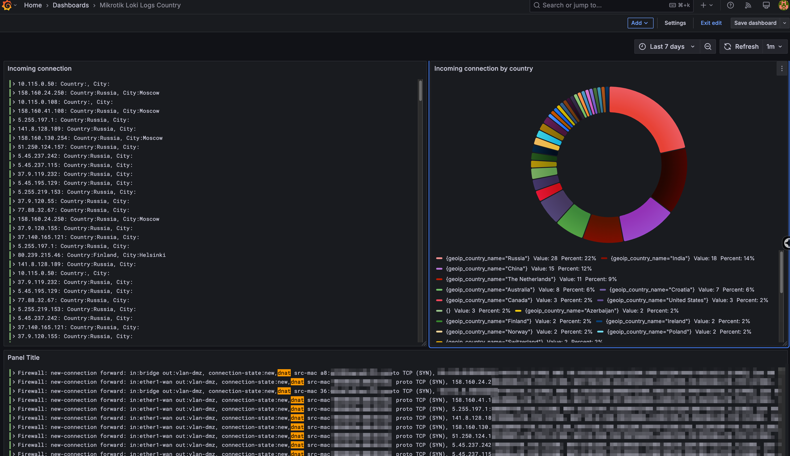

# Grafana dashboards

## Loki queries



### Visualization Logs: "Incoming connections"

Request for Loki
```
{host="MikroTik-domru"} |= "dnat" | pattern `<_> src-mac <_>, proto <_>, <src_ip>:<src_port>-><dst_ip>:<dst_port>, <_>`
| line_format "{{.src_ip}}: Country:{{.geoip_country_name}}, City:{{.geoip_city_name}} "
```

### Visualization Pie Chart: "Incoming connections by country"

Request for Loki
```
count by(geoip_country_name) (rate({host="MikroTik-domru"} |= `dnat` [$__auto] ) )
```

### Visualization Logs on bottom

Request for Loki
```
{host="MikroTik-domru"} |= "dnat"
```

## Victorialogs queries


### Visualization Bar gauge: "Src IP DNAT"

Request for Victorialogs
```
dnat or snat | extract ", proto <proto>, <src-ip>:<src-port>-><dst-ip-port>, NAT <nat>" from _msg | stats by (src-ip) count() src_ip
```

### Visualization Stat: "Всего строчек лога"

Request for Victorialogs
```
* | count()
```

### Visualization Logs: "Incoming connections"

Request for Victorialogs
```
dnat | extract ", proto <proto>, <src-ip>:<src-port>-><dst-ip-port>, NAT <nat>" from _msg | format "⚠️ New connection from <src-ip>:<src-port> to <dst-ip-port>, proto: <proto>"
```

### Visualization Logs: "Outoging connections"

Request for Victorialogs
```
snat | extract ", proto <proto>, <src-ip>:<src-port>-><dst-ip-port>, NAT <nat>" from _msg | format "⚠️ New connection from <src-ip>:<src-port> to <dst-ip-port>, proto <proto>"
```

### Visualization Logs on the bottom

Request for Victorialogs
```
*
```
