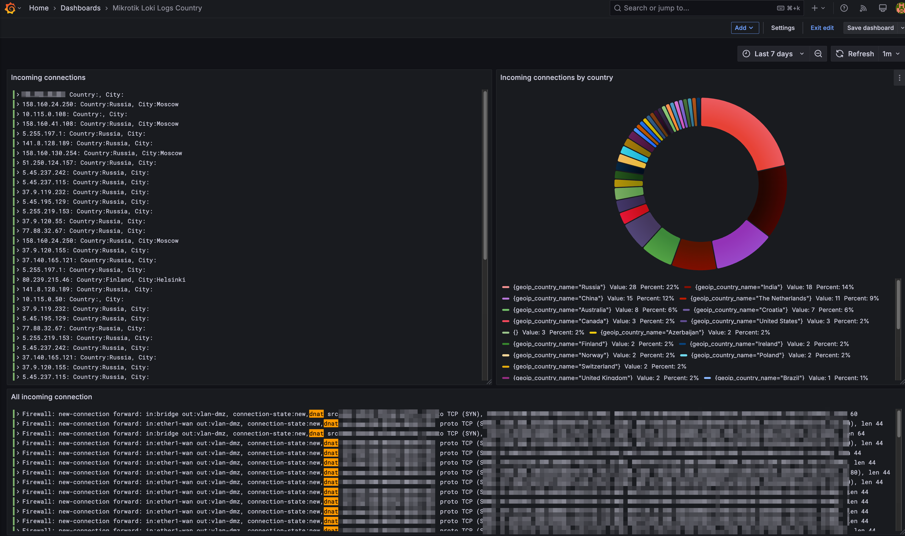

# Grafana dashboards

## Loki




[Loki dashboard for Grafana](./Mikrotik_Loki_Logs_Country.json)


## Victorialogs queries


### Visualization Bar gauge: "Src IP DNAT"

Request for Victorialogs
```
dnat or snat | extract ", proto <proto>, <src-ip>:<src-port>-><dst-ip-port>, NAT <nat>" from _msg | stats by (src-ip) count() src_ip
```

### Visualization Stat: "Всего строчек лога"

Request for Victorialogs
```
* | count()
```

### Visualization Logs: "Incoming connections"

Request for Victorialogs
```
dnat | extract ", proto <proto>, <src-ip>:<src-port>-><dst-ip-port>, NAT <nat>" from _msg | format "⚠️ New connection from <src-ip>:<src-port> to <dst-ip-port>, proto: <proto>"
```

### Visualization Logs: "Outoging connections"

Request for Victorialogs
```
snat | extract ", proto <proto>, <src-ip>:<src-port>-><dst-ip-port>, NAT <nat>" from _msg | format "⚠️ New connection from <src-ip>:<src-port> to <dst-ip-port>, proto <proto>"
```

### Visualization Logs on the bottom

Request for Victorialogs
```
*
```
